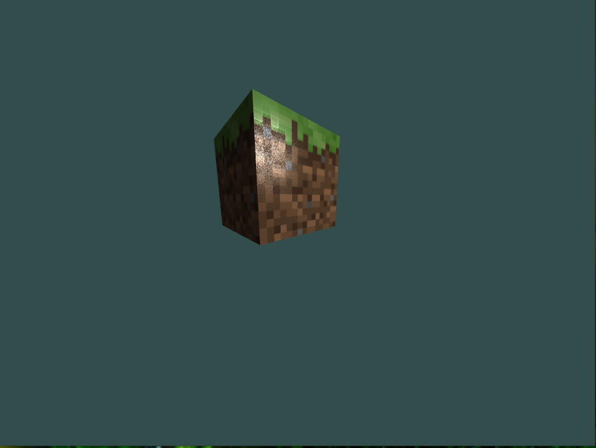

# CppCraft

How to build on Fedora:
- Install the following packages:
	- `glm-devel` 
	- `mesa-libGL-devel`
	- `glfw-devel` 
	- `assimp-devel` 
	- `stb_image-devel`
	- `glad` (is v1)
- Generate glad files: `glad --profile core --generator c --api gl=4.6 --spec gl --out-path glad`

How to build on Arch
- Install the following packages:
	- `glm`
	- `glfw`
	- `assimp`
	- `stb`
	- `glad` (is v2)
- Generate glad files:  `glad --api gl:core=4.6 --out-path glad c; mv glad/src/gl.c glad/src/glad.c; cp glad/include/glad/gl.h glad/include/glad/glad.h`
